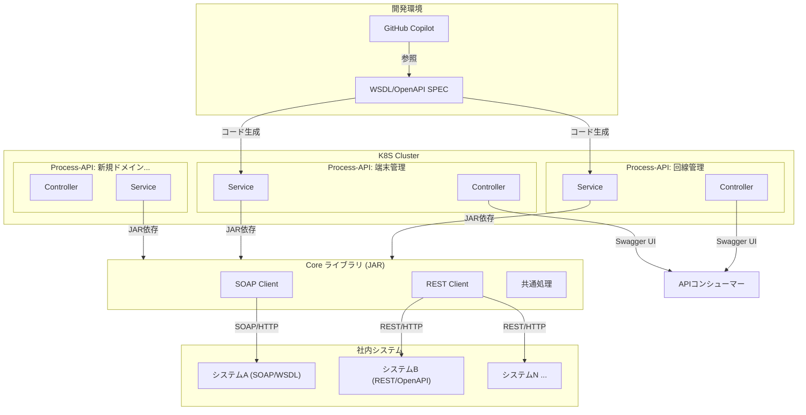
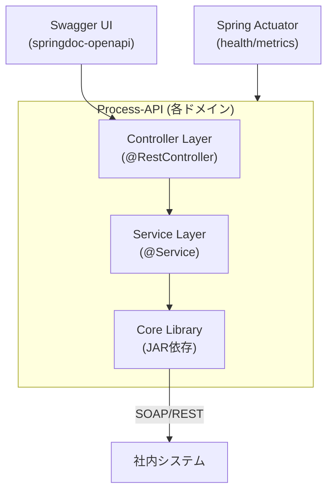

# Spring Boot APIテンプレートシステム

## 概要

Spring Bootベースのマルチプロジェクト構成APIテンプレートシステムです。VibeCoding（GitHub Copilot）での利用を前提とした、Coreライブラリと複数Process-APIテンプレートから構成されています。社内SOAP/RESTシステムへの接続機能を備えた、拡張性の高い開発基盤を提供します。

## 達成目標

1. **マルチプロジェクト構成のSpring Boot APIテンプレートシステムの構築**
   - Coreライブラリ: 社内SOAP/RESTシステム接続テンプレート
   - Process-APIテンプレート: ドメイン毎の外部提供用API群テンプレート

2. **VibeCoding（GitHub Copilot）対応の雛形提供**
   - `.github/copilot-instructions.md` の配置
   - WSDL/OpenAPIファイルのリポジトリ内配置
   - 新規ドメイン追加手順書（README.md / CONTRIBUTING.md）

3. **本番利用を想定した各種機能の実装**
   - Spring Actuatorによるヘルスチェック・メトリクス
   - springdoc-openapiによるSwagger UI提供
   - @ControllerAdviceによる共通エラーハンドリング
   - プロファイル分離による環境毎の設定管理

## システム構成



## レイヤー構成（Process-API）



## ディレクトリ構成

```
output_system/
├── core/                                    # Coreライブラリ
│   ├── src/main/java/jp/co/createlink/core/
│   │   ├── exception/                      # 共通例外クラス
│   │   │   ├── CoreException.java
│   │   │   └── SoapClientException.java
│   │   ├── soap/                           # SOAPクライアント実装
│   │   │   └── SampleSoapClient.java       # JAX-WS wsimportサンプル
│   │   ├── rest/                           # RESTクライアント実装
│   │   │   └── SampleRestClient.java       # Spring WebClientサンプル
│   │   └── config/                         # コア設定
│   │       └── CoreConfig.java
│   ├── src/test/java/jp/co/createlink/core/ # Coreライブラリテスト
│   ├── specs/
│   │   ├── wsdl/                           # ダミーWSDLファイル
│   │   └── openapi/                        # ダミーOpenAPIファイル
│   ├── build.gradle.kts                    # Core Gradle設定
│   └── README.md
│
├── process-api-template/                    # Process-APIテンプレート
│   ├── src/main/java/jp/co/createlink/processapi/
│   │   ├── exception/
│   │   │   ├── ErrorResponse.java           # エラーレスポンスDTO
│   │   │   └── GlobalExceptionHandler.java  # @ControllerAdvice
│   │   ├── controller/
│   │   │   └── SampleController.java        # REST Controllerサンプル
│   │   ├── service/
│   │   │   └── SampleService.java           # ビジネスロジック層
│   │   ├── dto/
│   │   │   └── SampleResponse.java          # レスポンスDTO
│   │   ├── config/
│   │   │   └── SwaggerConfig.java           # Swagger UI設定
│   │   └── SampleProcessApiApplication.java # メインアプリケーション
│   ├── src/test/java/jp/co/createlink/processapi/ # E2E・単体テスト
│   │   ├── controller/
│   │   ├── service/
│   │   ├── exception/
│   │   ├── actuator/
│   │   ├── document/
│   │   ├── config/
│   │   ├── integration/
│   │   └── war/
│   ├── src/main/resources/
│   │   ├── application.yml                  # デフォルト設定
│   │   ├── application-dev.yml              # 開発環境設定
│   │   ├── application-prod.yml             # 本番環境設定
│   │   └── logback-spring.xml               # ログ設定（SLF4J + Logback）
│   ├── specs/openapi/                       # OpenAPI定義ファイル
│   ├── build.gradle.kts                     # Process-API Gradle設定
│   ├── pom.xml                              # Maven設定（参考）
│   ├── README.md                            # ドメイン追加手順
│   ├── CONTRIBUTING.md                      # 貢献ガイド
│   └── ServletInitializer.java              # WAR展開用初期化
│
├── settings.gradle.kts                       # Gradle composite build設定
├── build.gradle.kts                          # ルートGradle設定
├── docker-compose.yml                        # （オプション）開発環境コンテナ構成
└── .gitignore
```

## WebAPIエンドポイント一覧

### Process-API サンプルエンドポイント

| メソッド | パス | 説明 |
|---------|------|------|
| GET | `/api/v1/sample` | Core経由でサンプルデータを取得 |
| GET | `/api/v1/sample/{id}` | Core経由で特定のサンプルデータを取得 |

### 管理エンドポイント（Spring Actuator）

| メソッド | パス | 説明 |
|---------|------|------|
| GET | `/actuator/health` | ヘルスチェック（K8S liveness/readiness probe用） |
| GET | `/actuator/info` | アプリケーション情報 |
| GET | `/actuator/metrics` | メトリクス情報 |

### Swagger UI

| パス | 説明 |
|------|------|
| `/swagger-ui.html` | Swagger UI（springdoc-openapi自動生成） |
| `/v3/api-docs` | OpenAPI 3.0 JSON |
| `/v3/api-docs.yaml` | OpenAPI 3.0 YAML |

詳細は [openapi.yaml](./openapi.yaml) を参照。

## 技術スタック

| カテゴリ | 選定技術 | 理由 |
|---------|---------|------|
| 言語 | Java 21 (LTS) | Virtual Threads、Record等の最新機能利用可能 |
| フレームワーク | Spring Boot 3.4.x | 最新安定版、Java 21完全サポート |
| ビルドツール | Gradle (Kotlin DSL) | マルチプロジェクトに強い、柔軟な設定 |
| サーブレットコンテナ | Tomcat | Spring Bootデフォルト、実績豊富 |
| SOAPクライアント | JAX-WS (wsimport) | 標準仕様、安定性 |
| RESTクライアント | Spring WebClient | リアクティブ対応、モダン |
| API仕様 | springdoc-openapi | Spring Boot統合、アノテーションから自動生成 |
| ログ | SLF4J + Logback | Spring Bootデフォルト |
| テスト | JUnit5 + MockMvc | Spring Boot標準 |

## 主要機能

### 1. Coreライブラリ（output_system/core/）

**SOAP/RESTクライアント機能**
- JAX-WS wsimportによるSOAPクライアント生成サンプル
- Spring WebClientによるREST接続サンプル
- ダミーWSDL/OpenAPIファイルの配置（`specs/`ディレクトリ）

**共通処理**
- 統一的な例外クラス（CoreException、SoapClientException）
- Spring設定クラス（CoreConfig）

### 2. Process-APIテンプレート（output_system/process-api-template/）

**Webアプリケーション機能**
- REST APIコントローラー（SampleController）
- ビジネスロジック層（SampleService）
- データ転送オブジェクト（DTO）

**API仕様・ドキュメント**
- springdoc-openapiによるSwagger UI提供
- OpenAPI 3.0準拠の自動生成ドキュメント

**監視・管理**
- Spring Actuatorによるヘルスチェック
- メトリクス収集
- アプリケーション情報エンドポイント

**エラーハンドリング**
- @ControllerAdviceによる共通エラーハンドリング
- 統一的なエラーレスポンス形式

**プロファイル分離**
- application.yml（デフォルト）
- application-dev.yml（開発環境）
- application-prod.yml（本番環境）

### 3. テスト機能

**単体テスト**
- JUnit5によるテストフレームワーク
- MockMvcによるコントローラーテスト
- Mockitoによるモック・スタブ

**統合テスト**
- Gradle composite buildの検証（CompositeBuildIntegrationTest）
- WAR形式のデプロイメント検証（WarDeploymentTest）

**テストテンプレート**
- SampleControllerTest: コントローラーテストサンプル
- SampleServiceTest: サービスレイヤーテストサンプル
- GlobalExceptionHandlerTest: エラーハンドリングテスト
- ActuatorEndpointTest: 管理エンドポイントテスト
- ApplicationConfigFilesTest: 設定ファイル検証
- ProcessApiDocumentationTest: API仕様ドキュメント検証
- NotFoundEndpointTest: 存在しないエンドポイント処理

### 4. VibeCoding支援

**GitHub Copilot統合**
- `.github/copilot-instructions.md` によるCopilot指示
- WSDL/OpenAPI仕様ファイルのリポジトリ内配置
- 新規ドメイン追加手順の明文化

**開発ガイド**
- README.md: プロジェクト概要と起動方法
- CONTRIBUTING.md: 貢献ガイドと新規ドメイン追加手順

## VibeCoding（GitHub Copilot）での使用方法

### 新規Process-APIドメインの追加手順

1. **リポジトリの作成**
   ```bash
   # GitHub上で process-api-{ドメイン名} リポジトリを作成
   # Gradle composite buildの設定で参照
   ```

2. **Copilot指示ファイルの確認**
   - `.github/copilot-instructions.md` を確認
   - Coreライブラリの仕様を理解
   - WSDL/OpenAPI仕様ファイルを参照

3. **テンプレートの複製**
   - `output_system/process-api-template/` を参照
   - コントローラー、サービス、DTOの実装パターンをコピー
   - Copilotに具体的なドメインロジックの生成を指示

4. **テストの作成**
   - テストテンプレート（`*Test.java`）を参照
   - JUnit5 + MockMvcのテストパターンに従う
   - Copilotにテストケースの追加を指示

5. **動作確認**
   ```bash
   cd output_system/process-api-{ドメイン名}
   ./gradlew build
   ./gradlew bootRun
   ```

## 起動方法

### ローカル開発環境

**前提条件**
- Java 21 がインストール済み
- Gradle 8.5以上（ラッパーで自動ダウンロード）

**Coreライブラリのビルド**
```bash
cd output_system/core
./gradlew build
```

**Process-APIテンプレートの起動**
```bash
cd output_system/process-api-template
./gradlew bootRun
```

**アクセスURL（デフォルト）**
- アプリケーション: `http://localhost:8080`
- Swagger UI: `http://localhost:8080/swagger-ui.html`
- ヘルスチェック: `http://localhost:8080/actuator/health`

### コンテナでの実行

```bash
cd output_system
docker compose up -d
```

## ビルド・デプロイ

### JAR形式（開発用）
```bash
cd output_system/process-api-template
./gradlew bootJar
# target/process-api-template-1.0.0.jar
```

### WAR形式（Tomcatデプロイ用）
```bash
cd output_system/process-api-template
./gradlew war
# build/libs/process-api-template-1.0.0.war
```

### Kubernetes デプロイ

WAR ファイルをTomcatコンテナにデプロイ：

```yaml
apiVersion: apps/v1
kind: Deployment
metadata:
  name: process-api-circuit
spec:
  replicas: 2
  template:
    spec:
      containers:
      - name: api
        image: tomcat:10.1-jdk21
        ports:
        - containerPort: 8080
        volumeMounts:
        - name: war
          mountPath: /usr/local/tomcat/webapps/ROOT.war
        livenessProbe:
          httpGet:
            path: /actuator/health
            port: 8080
        readinessProbe:
          httpGet:
            path: /actuator/health
            port: 8080
      volumes:
      - name: war
        configMap:
          name: process-api-war
```

## トラブルシューティング

### SOAP/REST接続エラー

社内システムが疎通可能な環境か確認：
```bash
# SOAP接続テスト
curl http://{soap-server}:port/axis/services/xxx?wsdl

# REST接続テスト
curl http://{rest-server}:port/api/xxx
```

### Swagger UIが表示されない

1. アプリケーションが起動しているか確認
   ```bash
   curl http://localhost:8080/actuator/health
   ```

2. springdoc-openapiのバージョンを確認
   ```bash
   ./gradlew dependencies | grep springdoc
   ```

### テストが失敗する

```bash
# 詳細ログを有効にしてテスト実行
./gradlew test --info
```

## ライセンス

UNLICENSED（社内利用のみ）

## 関連ドキュメント

| ドキュメント | 説明 |
|-------------|------|
| [ai_generated/requirements/](ai_generated/requirements/) | 要件ファイル一覧 |
| [output_system/core/README.md](output_system/core/README.md) | Coreライブラリドキュメント |
| [output_system/process-api-template/README.md](output_system/process-api-template/README.md) | Process-APIテンプレート新規ドメイン追加手順 |
| [output_system/process-api-template/CONTRIBUTING.md](output_system/process-api-template/CONTRIBUTING.md) | 貢献ガイド |
| [.github/copilot-instructions.md](.github/copilot-instructions.md) | GitHub Copilot統合ガイド |

## 参考資料

- [Spring Boot 3.4公式ドキュメント](https://spring.io/projects/spring-boot)
- [Gradle ユーザーマニュアル](https://docs.gradle.org/)
- [springdoc-openapi](https://springdoc.org/)
- [JAX-WS（Java Web Services）](https://docs.oracle.com/en/java/javase/21/docs/api/java.xml.ws/module-summary.html)
