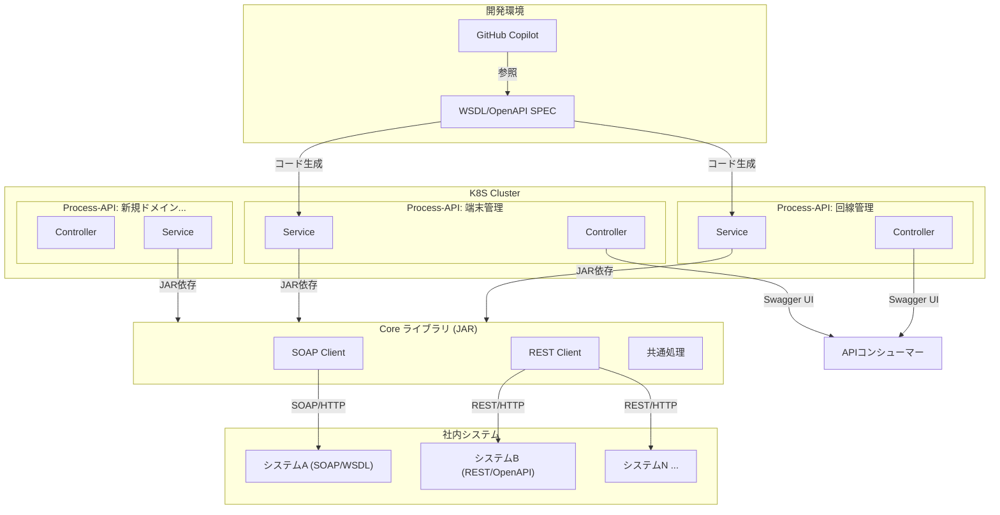
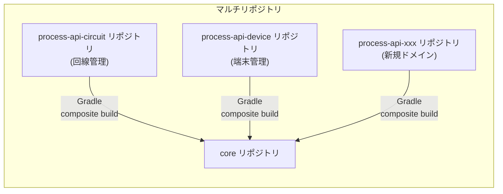
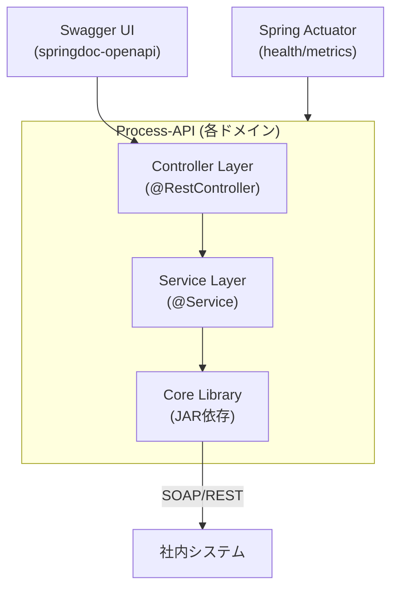

# システム構成図

## 全体アーキテクチャ

```mermaid
flowchart TB
    subgraph K8S["K8S Cluster"]
        subgraph PA1["Process-API: 回線管理"]
            PA1C["Controller"]
            PA1S["Service"]
        end
        subgraph PA2["Process-API: 端末管理"]
            PA2C["Controller"]
            PA2S["Service"]
        end
        subgraph PAn["Process-API: 新規ドメイン..."]
            PAnC["Controller"]
            PAnS["Service"]
        end
    end

    subgraph Core["Core ライブラリ (JAR)"]
        SOAP["SOAP Client"]
        REST["REST Client"]
        Common["共通処理"]
    end

    subgraph External["社内システム"]
        SysA["システムA (SOAP/WSDL)"]
        SysB["システムB (REST/OpenAPI)"]
        SysN["システムN ..."]
    end

    subgraph Dev["開発環境"]
        Copilot["GitHub Copilot"]
        SPEC["WSDL/OpenAPI SPEC"]
    end

    PA1S -->|"JAR依存"| Core
    PA2S -->|"JAR依存"| Core
    PAnS -->|"JAR依存"| Core

    SOAP -->|"SOAP/HTTP"| SysA
    REST -->|"REST/HTTP"| SysB
    REST -->|"REST/HTTP"| SysN

    Copilot -->|"参照"| SPEC
    SPEC -->|"コード生成"| PA1S
    SPEC -->|"コード生成"| PA2S

    PA1C -->|"Swagger UI"| Consumer["APIコンシューマー"]
    PA2C -->|"Swagger UI"| Consumer
```

## リポジトリ構成

```mermaid
flowchart LR
    subgraph Repos["マルチリポジトリ"]
        CoreRepo["core リポジトリ"]
        PA1Repo["process-api-circuit リポジトリ\n(回線管理)"]
        PA2Repo["process-api-device リポジトリ\n(端末管理)"]
        PAnRepo["process-api-xxx リポジトリ\n(新規ドメイン)"]
    end

    PA1Repo -->|"Gradle\ncomposite build"| CoreRepo
    PA2Repo -->|"Gradle\ncomposite build"| CoreRepo
    PAnRepo -->|"Gradle\ncomposite build"| CoreRepo
```

## レイヤー構成（Process-API）

```mermaid
flowchart TB
    subgraph ProcessAPI["Process-API (各ドメイン)"]
        Controller["Controller Layer\n(@RestController)"]
        Service["Service Layer\n(@Service)"]
        CoreLib["Core Library\n(JAR依存)"]
    end

    Controller --> Service
    Service --> CoreLib
    CoreLib -->|"SOAP/REST"| ExternalSys["社内システム"]

    SwaggerUI["Swagger UI\n(springdoc-openapi)"] --> Controller
    Actuator["Spring Actuator\n(health/metrics)"] --> ProcessAPI
```
